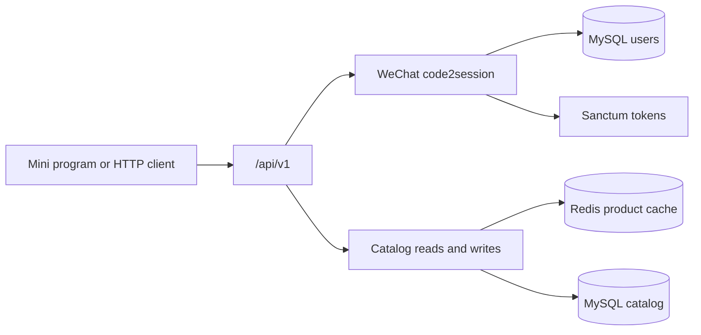
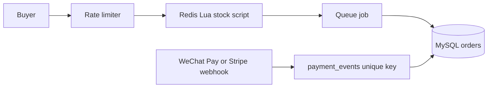

# FlashMall API

A production-style Laravel 13 backend for WeChat Mini Program / super-app commerce. This foundation ships mini program login, a cached product catalog, and OpenAPI docs. Redis flash sales, WeChat Pay and Stripe, queues, and a measured load test are the milestones that follow.

[](https://github.com/z18666607076-tech/flashmall-api/actions/workflows/ci.yml)


## Live demo

Not deployed yet. Run it locally and open the generated docs:

- API reference: [http://localhost:8000/docs/api](http://localhost:8000/docs/api)
- OpenAPI document: [http://localhost:8000/docs/api.json](http://localhost:8000/docs/api.json)

Mini program login uses a fake driver in this environment. Any `code` that does not start with `invalid` signs in a user and returns a Sanctum token. No WeChat or payment credentials are required.

## Why this project

This is a Laravel rewrite of the commerce flows behind a WeChat Mini Program shop: login, catalog, and (next) checkout under concurrency. The domain comes from about ten years of PHP, ThinkPHP, and mini program work. The engineering around it — tests, Docker, CI, and an English API contract — is what a remote team needs in order to trust the delivery.

## Features

Shipped in this foundation:

- Versioned JSON API under `/api/v1`, with one error shape for 401, 404, and validation failures
- WeChat Mini Program login (`code2session`) behind `WeChatMiniProgramClient`, with a fake driver for local use and tests and an HTTP driver for real credentials
- Sanctum personal access tokens
- Catalog: categories, products, and SKUs (price in cents, stock, optimistic `version`)
- Redis cache for published product reads, invalidated on catalog writes
- OpenAPI 3.1 docs generated by Scramble
- Pest feature tests against MySQL 8 and Redis

Still on the roadmap: cart and orders, Redis flash sale, WeChat Pay and Stripe, queues, a public demo, and a load-test report.

## Architecture

What runs today:



Login exchanges `wx.login` code for an openid. The HTTP driver calls WeChat; the fake driver derives a stable openid and never leaves the process. The session key is not stored. A new Sanctum token is issued on every login. Published product reads are cached under a Redis tag. `Cache::touch()` extends the TTL when a cached entry is read again. Creating or updating a category, product, or SKU flushes that tag.

Planned path for the flash-sale and payment milestones (not implemented):



## Key design decisions

- **WeChat is an interface.** Tests and local Docker bind the fake driver. `WECHAT_DRIVER=http` switches to `jscode2session`. App id and secret come from the environment and are never committed.
- **Catalog writes are authenticated, reads are public.** Any Sanctum token can change the catalog until an admin role exists. Guests only see `published` products.
- **Money is integer cents** plus a 3-letter currency, so later payment code does not start from floats.
- **SKU `version` increments when stock changes.** Checkout can use that column for optimistic locking. This milestone does not decrement stock.
- **Product cache is tag-based Redis.** A write flushes the catalog tag instead of guessing every list key. The cache store must support tags (`CACHE_STORE=redis`).
- **One JSON error shape.** API 404s return `{ "message": "Resource not found." }`. Unauthenticated calls return `{ "message": "Unauthenticated." }`. Validation returns `message` and `errors`.

ADRs for oversell prevention, idempotent webhooks, and delayed order cancellation will be added with those milestones. They are not in this repository yet.

## Performance

No load-test numbers are published. k6 results will be added only after they are measured. The flash-sale milestone is the one that has to show zero oversell under concurrency.

## Tech stack

PHP 8.4 · Laravel 13.34 · MySQL 8.4 · Redis 7 · Sanctum 4.3 · Scramble 0.13 · Pest 5.3 · PHPUnit 13 · Larastan 3.12 (level 6) · Pint 1.32 · Docker Compose · GitHub Actions

Laravel 13 pieces used on purpose:

- `#[Middleware]` on the mini program login action for the login rate limit
- `Cache::touch()` so a hot product read extends its TTL
- Eloquent `#[Fillable]` and `#[Hidden]` attributes

## Getting started

Requirements: Docker with Compose. Host PHP is not required.

```bash
git clone https://github.com/z18666607076-tech/flashmall-api.git
cd flashmall-api
cp .env.example .env
docker compose up -d --build
make test
```

The app listens on [http://localhost:8000](http://localhost:8000). Compose runs migrations and seeds a small English catalog on boot. The app container uses PHP's built-in server so a clean clone does not need nginx. MySQL is published on port 3306 (`flashmall` / `secret`, root password `secret`) and Redis on port 6379. Those passwords are for the local demo only.

The `APP_KEY` in `docker-compose.yml` is a local development key so a clean clone boots without a manual step. Override it outside this compose file.

Useful commands:

```bash
make logs
make lint
make analyse
make down
```

`make test` runs Pest inside the app container against the `flashmall_testing` database, so it does not wipe the seeded demo data.

### Try the API

```bash
curl -s http://localhost:8000/api/v1/health
curl -s http://localhost:8000/api/v1/products

curl -s -X POST http://localhost:8000/api/v1/auth/wechat \
  -H 'Accept: application/json' \
  -H 'Content-Type: application/json' \
  -d '{"code":"demo-user","name":"Ada"}'
```

Send the returned token as `Authorization: Bearer <token>` when creating categories, products, or SKUs.

To call WeChat for real, set `WECHAT_DRIVER=http`, `WECHAT_MINI_PROGRAM_APP_ID`, and `WECHAT_MINI_PROGRAM_SECRET`. Leave them empty in git.

## Testing and quality

GitHub Actions runs, on PHP 8.4 with MySQL 8.4 and Redis 7 service containers:

- Pint (`vendor/bin/pint --test`)
- Larastan / PHPStan level 6
- Pest (`php artisan test`)

Feature tests cover health and error payloads, WeChat login (including the fake driver and login throttling), category and product CRUD, SKU stock versioning, Redis cache hits, the seeder, and the OpenAPI document. The HTTP WeChat client is covered with `Http::fake()` and does not call WeChat.

Coverage is not enforced yet. The later flash-sale milestone is where the suite has to prove it under concurrency.

## API documentation

Scramble builds the OpenAPI document from the `/api/v1` routes, form requests, and API resources.

- UI: `/docs/api`
- Spec: `/docs/api.json`

Authenticated routes are documented with bearer auth. Public catalog reads are marked public.

| Method | Path | Auth |
| --- | --- | --- |
| GET | `/api/v1/health` | Public |
| POST | `/api/v1/auth/wechat` | Public, 10 requests / minute / IP |
| GET | `/api/v1/auth/me` | Sanctum |
| GET | `/api/v1/categories` | Public |
| POST, PUT, PATCH, DELETE | `/api/v1/categories/...` | Sanctum |
| GET | `/api/v1/products` | Public. Query: `category_id`, `q`, `page`, `per_page` |
| GET | `/api/v1/products/{id}` | Public, published only |
| POST, PUT, PATCH, DELETE | `/api/v1/products/...` | Sanctum |
| POST | `/api/v1/products/{product}/skus` | Sanctum |
| PUT, PATCH, DELETE | `/api/v1/skus/{sku}` | Sanctum |

## Roadmap

- [x] Laravel 13 app, Docker Compose, GitHub Actions
- [x] Versioned `/api/v1` routes and a consistent JSON error format
- [x] Sanctum API tokens
- [x] WeChat Mini Program login with a fake driver and an HTTP driver
- [x] Categories, products, SKUs, factories, seeders, and Redis read cache
- [x] OpenAPI docs via Scramble
- [ ] Email login for a web storefront
- [ ] Cart and checkout
- [ ] Order state machine and delayed cancellation of unpaid orders
- [ ] Redis Lua flash sale: atomic stock, per-user limit, rate limit, async order write
- [ ] WeChat Pay V3 and Stripe behind a `PaymentGateway` interface
- [ ] Idempotent, signature-checked payment webhooks
- [ ] Redis queues, `Queue::route()`, and Horizon
- [ ] Public demo
- [ ] k6 load-test report with measured numbers

## License and contact

MIT. See [LICENSE](LICENSE).

GitHub: [z18666607076-tech](https://github.com/z18666607076-tech)
