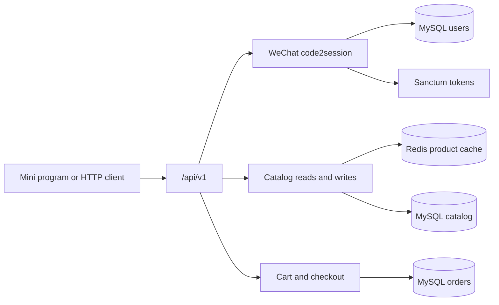
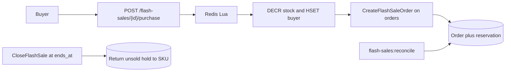
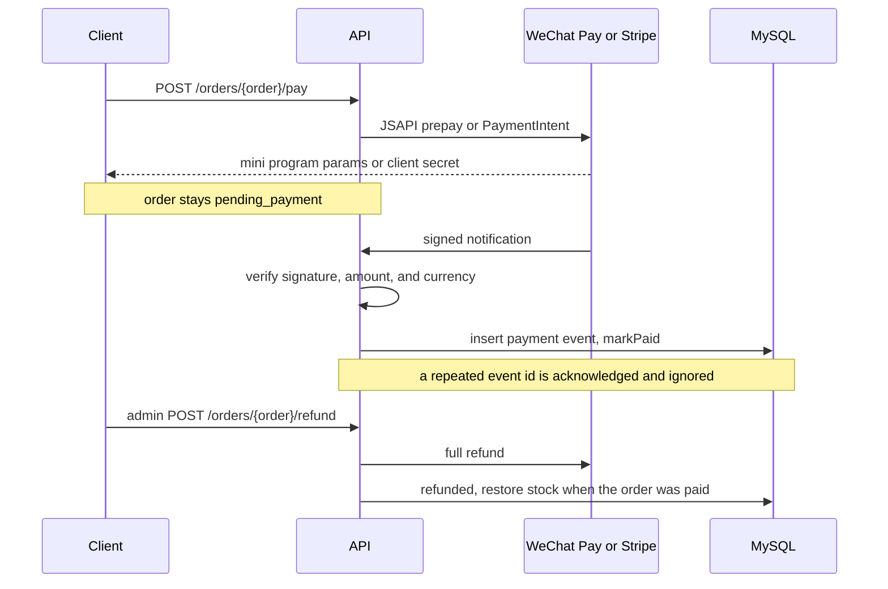

# FlashMall API

A production-style Laravel 13 backend for WeChat Mini Program / super-app commerce. This milestone ships mini program login, a cached catalog, cart and checkout, an order state machine, Redis flash sales, WeChat Pay and Stripe payment flows, Horizon, a production compose file for a 4 GB CentOS server, and a measured k6 report. Email login is still on the roadmap.

[](https://github.com/z18666607076-tech/flashmall-api/actions/workflows/ci.yml)


## Live demo

Not published yet. The production stack is ready to start on the owner's CentOS server once the domain's ICP filing is approved and DNS points at that machine. The public URL will be `https://<your-domain>`.

- Deploy (English): [docs/DEPLOY.md](docs/DEPLOY.md)
- 部署说明: [docs/DEPLOY.zh-CN.md](docs/DEPLOY.zh-CN.md)
- Measured load test: [docs/LOAD_TEST.md](docs/LOAD_TEST.md)

Until then, run the local stack and open the generated docs:

- API reference: [http://localhost:8000/docs/api](http://localhost:8000/docs/api)
- OpenAPI document: [http://localhost:8000/docs/api.json](http://localhost:8000/docs/api.json)

Mini program login uses a fake driver in this environment. Any `code` that does not start with `invalid` signs in a user and returns a Sanctum token. Payments use a fake driver too. No WeChat merchant account or Stripe secret is configured, and live payment credentials were not used to build or test this repository. The demo login code on a production demo is `demo`.

## Why this project

This is a Laravel rewrite of the commerce flows behind a WeChat Mini Program shop: login, catalog, checkout, and a flash sale that must not oversell. The domain comes from about ten years of PHP, ThinkPHP, and mini program work. The engineering around it — tests, Docker, CI, and an English API contract — is what a remote team needs in order to trust the delivery.

## Features

Shipped:

- Versioned JSON API under `/api/v1`, with one error shape for 401, 403, 404, and validation failures
- WeChat Mini Program login (`code2session`) behind `WeChatMiniProgramClient`, with a fake driver for local use and tests and an HTTP driver for real credentials
- Sanctum personal access tokens, plus an `is_admin` flag for catalog and flash-sale writes
- Catalog: categories, products, and SKUs (price in cents, stock, optimistic `version`)
- Redis cache for published product reads, invalidated on catalog and stock writes
- Per-user cart with quantity checks against current stock
- Checkout that snapshots line prices, locks SKU rows, and supports an `Idempotency-Key`
- Order state machine: `pending_payment`, `paid`, `shipped`, `completed`, `cancelled`, `refunded`
- Delayed `CancelUnpaidOrder` job that restores stock when payment never arrives
- Flash sales: Redis Lua stock decrement, one purchase per user, async order write, and `flash-sales:reconcile`
- WeChat Pay API v3 (JSAPI / mini program) and Stripe PaymentIntents behind `PaymentGateway`, with fake drivers by default and HTTP drivers for signed live requests
- `POST /api/v1/orders/{order}/pay` returns the client params for the selected channel
- Signature-checked payment webhooks that are idempotent, verify amount and currency, and call `TransitionOrder::markPaid()`
- Admin refunds for both channels, including refund notifications and stock restoration
- Laravel Horizon on the Redis `orders` queue, with the dashboard limited to admins
- Production compose file: PHP-FPM, Caddy, MySQL, Redis, Horizon, and a scheduler, tuned for 4 GB RAM
- Demo mode: seeded catalog and flash sale, fake payments, rate limits, and a nightly reset
- OpenAPI 3.1 docs generated by Scramble
- Pest tests against MySQL 8 and Redis, including a concurrent flash-sale reservation test
- k6 scripts and a load-test report with numbers measured on the agent VM

Still on the roadmap: email login, and publishing the live demo URL once the server is online.

## Architecture

What runs today:



Login exchanges `wx.login` code for an openid. The HTTP driver calls WeChat; the fake driver derives a stable openid and never leaves the process. The session key is not stored. A new Sanctum token is issued on every login. Published product reads are cached under a Redis tag. `Cache::touch()` extends the TTL when a cached entry is read again. Catalog writes, checkout, and flash-sale stock holds flush that tag.

Flash sale path:



Payment path:



Checkout still locks SKU rows, writes `pending_payment`, and schedules `CancelUnpaidOrder`. Paying does not decrement stock again. `markPaid()` only runs after a verified notification. A refund notification that arrives while the order is still pending cancels it and restores stock, so a later payment success cannot fulfill it.

## Key design decisions

- **WeChat is an interface.** Tests and local Docker bind the fake driver. `WECHAT_DRIVER=http` switches to `jscode2session`. App id and secret come from the environment and are never committed.
- **Catalog and flash-sale writes require `is_admin`.** Any Sanctum token can use the cart, checkout, and flash-sale purchase. Guests only see `published` products and open sales. There is no public endpoint that sets `is_admin`.
- **Money is integer cents** plus a 3-letter currency, so later payment code does not start from floats. Checkout copies the SKU price onto the order line. A flash sale copies its own price.
- **Checkout locks SKU rows in id order** inside one transaction, then decrements stock. The same lock order is used when stock comes back, so two checkouts cannot oversell the last unit.
- **`Idempotency-Key` is scoped to the user.** The same key returns the original order and does not check the cart out again. A missing key always creates a new order.
- **Unpaid orders expire on a delayed job.** `CancelUnpaidOrder` is routed to the `orders` queue with `Queue::route()` and `#[Tries]` / `#[Backoff]`. The sync driver runs it immediately, and the job leaves the order alone until `expires_at`. Cancelling restores SKU stock, or returns a flash-sale unit to Redis while the sale is still open.
- **Flash-sale stock is a Redis hold.** Creating a sale moves `total_stock` off the SKU. One Lua script decrements that counter and records the buyer. A second purchase by the same user is rejected. `CreateFlashSaleOrder` writes the MySQL order afterwards. `php artisan flash-sales:reconcile` creates any reservation that never got an order and closes sales whose window has ended, returning unsold units to the SKU.
- **SKU `version` increments when stock changes.** The column is there for a later optimistic check. The lock in checkout is what protects this milestone.
- **Product cache is tag-based Redis.** A write flushes the catalog tag instead of guessing every list key. The cache store must support tags (`CACHE_STORE=redis`).
- **Payment clients are hand-written.** WeChat Pay API v3 and Stripe PaymentIntents live in this repository rather than behind `wechatpay/wechatpay` or `stripe/stripe-php`. The visible parts are RSA-SHA256 request and mini program signatures, AES-256-GCM notification decryption, platform public-key checks, and Stripe's documented `t` / `v1` HMAC (`hash_hmac('sha256', timestamp.payload, secret)` with the secret as the raw key). Those libraries were current on 2026-10-04 (`wechatpay/wechatpay` 1.5.0, `stripe/stripe-php` 22.0.0) and were not installed. Live WeChat Pay and Stripe credentials were not used.
- **`PAYMENTS_DRIVER=fake` is the default.** Fake WeChat returns a `paySign` of `fake` and a deterministic `prepay_id`. Fake Stripe returns `pi_fake_{order_no}_secret_test`. `PAYMENTS_DRIVER=http` signs real requests. Tests exercise that driver with `Http::fake()` and keys generated in the suite.
- **Webhooks are idempotent and amount-checked.** Processed ids are unique on `(channel, event_id)`. A retry returns success and does not move the order again. Amount and currency must match the order; a mismatch is rejected and the event is not stored, so a corrected retry can still succeed. Out-of-order refunds cancel a pending order before a later success can mark it paid.
- **Refunds are full and admin-only.** The admin action calls the channel only when the order can move to `refunded`, then restores stock for a paid order. A shipped refund does not put stock back. `completed` stays terminal. The buyer cannot refund.
- **Horizon runs the queues.** The worker is `php artisan horizon` on `orders` and `default`. `/horizon` requires an admin Sanctum user even when `APP_ENV=local`.
- **One JSON error shape.** API 404s return `{ "message": "Resource not found." }`. Unauthenticated calls return `{ "message": "Unauthenticated." }`. Forbidden catalog writes return 403. Commerce conflicts return `{ "message": "..." }` with 409 or 422. Validation returns `message` and `errors`.

## Performance

k6 was run against the production compose file on the machine that produced this commit. Catalog reads averaged 6.44 ms (about 313 requests/s). A 40-iteration checkout averaged 36.01 ms. Of 24 simultaneous flash-sale purchases, 10 were accepted and 14 were sold out, matching the seeded stock of 10. Those figures are not from the owner's CentOS server. Hardware, container limits, and the raised rate limits used for the run are in [docs/LOAD_TEST.md](docs/LOAD_TEST.md). The Pest suite still spawns concurrent PHP processes against the Lua script and asserts that reservations stop at `total_stock`.

## Tech stack

PHP 8.4 · Laravel 13.34 · MySQL 8.4 · Redis 7 · Sanctum 4.3 · Horizon 5.50 · Scramble 0.13 · Pest 5.3 · PHPUnit 13 · Larastan 3.12 (level 6) · Pint 1.32 · Docker Compose · GitHub Actions

Laravel 13 pieces used on purpose:

- `#[Middleware]` on the mini program login action and on flash-sale purchase
- `#[Authorize('admin')]` on catalog writes, flash-sale management, and order fulfilment
- `Queue::route()` sends order and flash-sale jobs to the `orders` queue
- `#[Tries]` and `#[Backoff]` on those jobs
- `Cache::touch()` so a hot product read extends its TTL
- Eloquent `#[Fillable]` and `#[Hidden]` attributes

## Getting started

Requirements: Docker with Compose. Host PHP is not required.

```bash
git clone https://github.com/z18666607076-tech/flashmall-api.git
cd flashmall-api
cp .env.example .env
docker compose up -d --build
make test
```

The app listens on [http://localhost:8000](http://localhost:8000). Compose runs migrations and seeds a small English catalog, including one open flash sale, on boot. The app container uses PHP's built-in server so a clean clone does not need nginx. A `worker` service runs `php artisan horizon` so unpaid orders cancel and flash-sale windows close on time. The Horizon dashboard is at [http://localhost:8000/horizon](http://localhost:8000/horizon) and accepts only an admin Sanctum bearer token. MySQL is published on port 3306 (`flashmall` / `secret`, root password `secret`) and Redis on port 6379. Those passwords are for the local demo only. Payment requests stay on the fake driver unless `PAYMENTS_DRIVER=http` and the empty `WECHAT_PAY_*` / `STRIPE_*` values in `.env.example` are filled in.

The `APP_KEY` in `docker-compose.yml` is a local development key so a clean clone boots without a manual step. Override it outside this compose file. The production stack is separate: [docs/DEPLOY.md](docs/DEPLOY.md).

Useful commands:

```bash
make logs
make lint
make analyse
make down
```

`make test` runs Pest inside the app container against the `flashmall_testing` database and the sync queue, so it does not wipe the seeded demo data or depend on the worker.

### Try the API

```bash
curl -s http://localhost:8000/api/v1/health
curl -s http://localhost:8000/api/v1/products

curl -s -X POST http://localhost:8000/api/v1/auth/wechat \
  -H 'Accept: application/json' \
  -H 'Content-Type: application/json' \
  -d '{"code":"demo-user","name":"Ada"}'
```

Send the returned token as `Authorization: Bearer <token>` for the cart and checkout. Catalog writes and flash-sale management also require `is_admin` on that user. There is no API to grant the flag; set it in a seeder or tinker for a local admin.

To call WeChat for real, set `WECHAT_DRIVER=http`, `WECHAT_MINI_PROGRAM_APP_ID`, and `WECHAT_MINI_PROGRAM_SECRET`. Leave them empty in git.

## Testing and quality

GitHub Actions runs, on PHP 8.4 with MySQL 8.4 and Redis 7 service containers:

- Pint (`vendor/bin/pint --test`)
- Larastan / PHPStan level 6
- Pest (`php artisan test`)

Feature tests cover health and error payloads, WeChat login (including the fake driver and login throttling), category and product CRUD, admin authorization, the cart, checkout and idempotency, the order state machine, unpaid-order cancellation, SKU stock versioning, Redis cache hits, flash-sale purchase and reconciliation, the seeder, and the OpenAPI document. Two concurrency tests spawn separate PHP processes: one against the flash-sale Lua script, and one against checkout row locks. The HTTP WeChat login client is covered with `Http::fake()` and does not call WeChat. Payment tests sign WeChat notifications with an RSA key generated in the suite, verify Stripe webhooks with the documented HMAC and a test secret, and reject amount mismatches, bad signatures, and duplicate event ids. The HTTP payment drivers are covered with `Http::fake()`. No live WeChat Pay or Stripe call is made.

Coverage is not enforced yet.

## API documentation

Scramble builds the OpenAPI document from the `/api/v1` routes, form requests, and API resources.

- UI: `/docs/api`
- Spec: `/docs/api.json`

Authenticated routes are documented with bearer auth. Public catalog reads are marked public.

| Method | Path | Auth |
| --- | --- | --- |
| GET | `/api/v1/health` | Public |
| POST | `/api/v1/auth/wechat` | Public, 10 requests / minute / IP |
| GET | `/api/v1/auth/me` | Sanctum |
| GET | `/api/v1/categories` | Public |
| POST, PUT, PATCH, DELETE | `/api/v1/categories/...` | Admin |
| GET | `/api/v1/products` | Public. Query: `category_id`, `q`, `page`, `per_page` |
| GET | `/api/v1/products/{id}` | Public, published only |
| POST, PUT, PATCH, DELETE | `/api/v1/products/...` | Admin |
| POST | `/api/v1/products/{product}/skus` | Admin |
| PUT, PATCH, DELETE | `/api/v1/skus/{sku}` | Admin |
| GET, POST, PATCH, DELETE | `/api/v1/cart` and `/api/v1/cart/items` | Sanctum |
| POST | `/api/v1/orders` | Sanctum. Optional `Idempotency-Key` header |
| GET | `/api/v1/orders` and `/api/v1/orders/{order}` | Sanctum, owner or admin |
| POST | `/api/v1/orders/{order}/cancel` | Owner |
| POST | `/api/v1/orders/{order}/pay` | Owner. Body: `channel` = `wechat` or `stripe` |
| POST | `/api/v1/payments/wechat/notify` | WeChat Pay signature, not Sanctum |
| POST | `/api/v1/payments/stripe/webhook` | Stripe signature, not Sanctum |
| POST | `/api/v1/orders/{order}/ship`, `/complete`, `/refund` | Admin |
| GET | `/api/v1/flash-sales` and `/api/v1/flash-sales/{id}` | Public |
| POST | `/api/v1/flash-sales` and `/api/v1/flash-sales/{id}/cancel` | Admin |
| POST | `/api/v1/flash-sales/{id}/purchase` | Sanctum, 30 requests / minute / user |

## Roadmap

- [x] Laravel 13 app, Docker Compose, GitHub Actions
- [x] Versioned `/api/v1` routes and a consistent JSON error format
- [x] Sanctum API tokens
- [x] WeChat Mini Program login with a fake driver and an HTTP driver
- [x] Categories, products, SKUs, factories, seeders, and Redis read cache
- [x] OpenAPI docs via Scramble
- [x] Admin flag for catalog and flash-sale writes
- [x] Cart and checkout, with price snapshots and an idempotency key
- [x] Order state machine and delayed cancellation of unpaid orders
- [x] Redis Lua flash sale: atomic stock, per-user limit, async order write, reconciliation
- [x] WeChat Pay V3 and Stripe behind `PaymentGateway`
- [x] Idempotent, signature-checked payment webhooks
- [x] Horizon on the Redis `orders` queue
- [x] Production compose file, demo mode, and CentOS deploy guides
- [x] k6 load-test report with measured numbers
- [ ] Email login for a web storefront
- [ ] Public URL, after ICP filing and DNS on the owner's server

## License and contact

MIT. See [LICENSE](LICENSE).

GitHub: [z18666607076-tech](https://github.com/z18666607076-tech)
